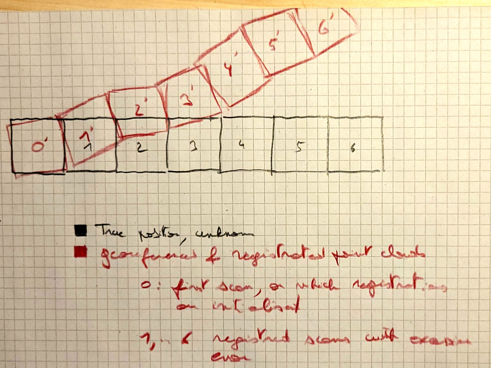

# Problem statement

Point clouds (and particularly TLS point clouds) can be georeferenced by using a gnss reciever, with the optional usage of RTK or PPK to increase the accuracy of the georeferencing. 
However, those geolocations always fave a certain error. In theory, using RTK or PPK can limit the error to a few centimeters, but in practice, depending to signal to noise ratio and other factors, the error can be higher, even using RTK or PPK (we have experienced errors of about 50cm-1m in certain cases).
This means that **the only georeferencing is not a sufficient method to register the point clouds**, and additional registration methods are needed. Those registration methods use features in the point clouds to align them, but also have a certain error. For instance, using an ICP registration algorithm, we could align two point clouds but do so with a rotational error of 1 degree. **If we iteratively register point clouds, the error will propagate and the final registration will induce large translations** of the point clouds, inconsistant with the geolocation (see illustration hereunder). We need a method to register the point clouds that limits the error propagation of registration errors in the georeferencing of the point cloud. This is the task of this repository.

  

While the error between `0` and `0'` is supposed small (enough), the registration error between the `*'` scans mean that the error between `6` and `6'` is too large to be tolerated.

## 3 sets of point clouds

We have three sets of point clouds that we can distinguish:

- **Ground-truth**: those are the *theoretical*, perfectly georeferenced point clouds. They are the result we want to achieve as closely as possible. (scans `0`, `1`, `2`, `3`, `4`, `5` and `6` in the illustration above)
- **Initial georeferenced point clouds** those are the point clouds that are georeferenced using the GNSS receiver, but that are potentially misaligned
- **Registered point clouds**: those are the point clouds we want to obtain, and are :
    - Aligned to each other within the tolerances of registration methods
    - As close as possible to their ground-truth georeferenced position

# Additional intent

Because statistically we repeat the same operation (the scanning with the GNSS receiver) multiple times, theoretically, we should be able to obtain a better georeferencing of each point clouds after combining the different point clouds, if for example we assume the georeferencing error to follow a normal distribution. The extent to which we can improve the georeferencing of the point clouds will be evaluated using synthetic data.